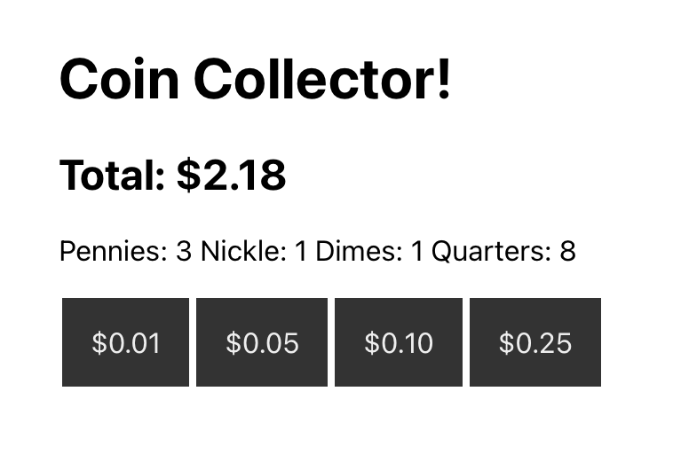
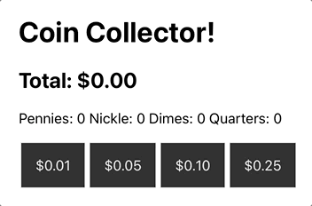

# Lab 2

We're hiring React decvelopers! Try this interview problem. 

## Interview problem

Create a React app that tracks a collection of coins. You need to count the number of Pennies, Nickles, Dimes, and Quarters. You'll also show the total amount of all coins. 

You should have a button that adds one of each coin type. 

Your final work might look like this: 

Your page should have the following elements: 

- title
- total - displays the total amount of all coins
- pennies - displays the number of pennies collected
- nickles - display the number of nickles collected
- dimes - displays the number of dimes collected
- quarters - displays the number quarters collected

Your finished app should work like the animated gif below. When the buttons are clicked notice the count of coins and the total amount are updated. 

Here is an outline of the steps you might follow: 

- Create a new react app with: `npx create-react-app coin-counter`
- Use the useState hook to define a variable for a counter. Create a variable and a setter function for: 
	- pennies and setPennies
	- nickles and setNickles
	- dimes and setDimes
	- quarters and setQuarters
- Define a variable total and set the value to pennies * 0.01 + nickles * 0.05 etc. 
- Create a button to add each of the coin types. Call the setter function for the coin type and add one to the current value.
